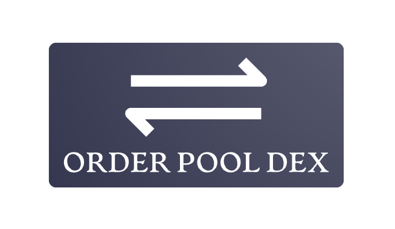

#  
# Order Pool Decentralized Exchange
## Not Liquidity Pool, not Order Book, but Order Pool

## Demo

For demo see the [demo](/demo/READMR.md) folder.

## What it does
**Order Pool DEX** allows the users to exchange one fungible asset for another.
The new concept of **Order Pool** allows gas-efficient order management and execution. It does not require sizable capital deposit and it uses ChainLink for price discovery thus becoming immune to MEV abuse.

If a counter-party pool is not empty, maximal possible part the order executes as "taker", while the rest of the order is pooled and it becomes a "maker". Upon execution, the maker pays the taker a small fee (0.25%) and to the protocol another 0.05%. 

The orders execute in constant on-chain time and constant cost, regardless of the number of counter-parties involved in the trade.

## How it works

For each ChainLink price feed and a pair of ERC20 assets a pair of Order Pools can be created by the OrderPoolFactory contract in the protocol. This creates two pools symmetrically connected to each other. Each pool refers to the other as the "Reverse Pool".

The ChainLink feed designated upon the pair creation is used for price discovery. 

When the user desires to swap one asset in the pair for the other, he can chose the pair from a list on the left of the web front end. Once that pair user interface is displayed in the center, the user can type the amount of the asset to swap. 

The web application listens to new "block" events upon which it reads the latest price from the ChainLink feed and calculates and displays estimates for the resulting asset amount, and the fees.

As the user choses to swap the desired amount, maximum necessary part of the resulting asset is drawn from the Reverse Pool, giving a role of "Taker" to the user for this part. If this amount is insufficient, the remaining part of the order asset is placed in the Pool giving the user a role of "Maker" for this part. Other orders in the reverse direction can take this part or a fraction thereof, to fill the rest of this user's order.

Upon completion of the order, the user can withdraw its resulting asset by clicking on "withdraw" in the web application.

## Implementation

The Smart Contracts are written in Solidity and can execute on any EVM capable blockchain and using the ChainLink price feed contracts. The web user interface is written in JavaScript and using React and Ethers.js frameworks/libraries.

The Foundry tool set is used for testing and development.

Each Pool is implemented as an ever-growing array of orders. For each order, the following is recorded:
- Owner address, to allow withdrawal of the resulting asset from the Reverse Pool.
- Amount executed.
- Cumulative total orders' amount until and including that order.

In addition, the watermark of cumulative executed orders is kept up-to-date.

This allows for a counter-party to discover off-chain the range of orders to be used as it's counter-party. Then the counter-party can execute against this range of orders in constant time and gas cost, and record this execution in an additional, ever growing "Ranges" array, which elements record:
- The last order in the range. The range is inferred from this and the previous element in the array.
- The execution price pulled from the appropriate ChainLink Price Feed.
Note that partial fills are executed and paid out (settled) immediately instead of recorded in the Ranges array.

Upon withdrawal (settlement) of the executed orders, the payout amount is calculated from the prices recorded in the corresponding Range.

## Fairness

Makers' orders are queued in order of arrival and are executed in the same order.

The protocol is created by the owner.

The owner can:
- Create new swap pairs.
- Collect the protocol fees.

The owner **cannot**:
- Upgrade or change the protocol deployed at the same address.
- Change the fee percentages and/or structure.
- Change or influence orders.
- Change the ChainLink oracle used.
- Withdraw any funds other than the protocol fees.

## Future Work

To allow order cancellations, the execution should be divided in "epochs". Orders should should be withdrawn regardless of their execution status at the end of the epoch. 

## How to: Install, Test, Run

To install:
- Install the Foundry tool set.
- Clone this project from GitHub.
- Build the project using the command "foundry build".
- In the "web" subfolder, install the node modules using the command "node install".
- To install the contracts in the main folder run "./deploy.sh". 

To test and debug:
- Run Anvil in the main folder using the command "./anvil.sh".
- Run the tests using the command "./test.sh".
- To debug, if necessary, edit the failing test name in "debug.sh" and then run it using the command "./debug.sh".

To run:
- Start the web application by issuing the following command in the web folder "npm start". 
- Access the web application at http://localhost:3000.
