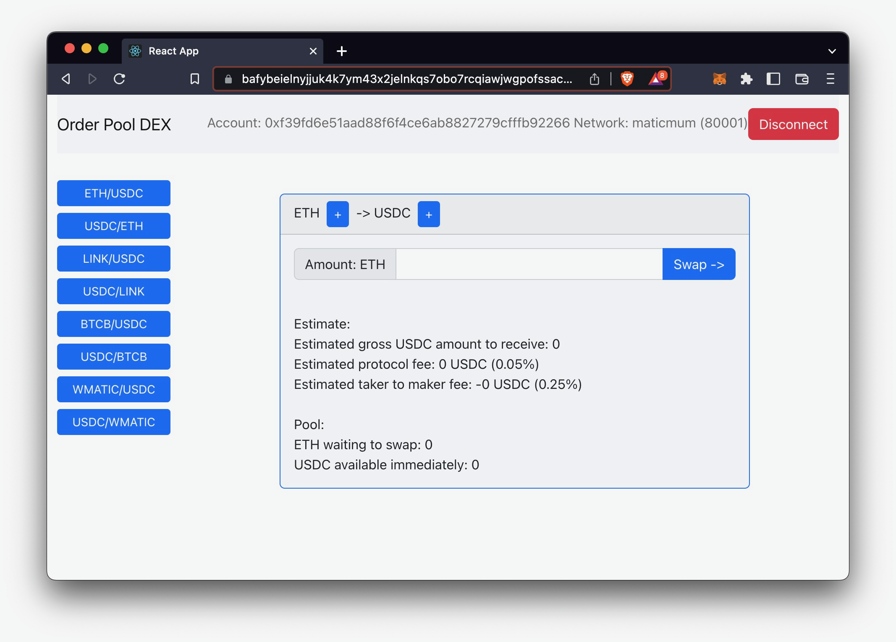

# Demo

Video on YouTube: [https://youtu.be/HQaJE6u69oM](https://youtu.be/HQaJE6u69oM)

Video on GitHub is [here](../doc/OrderPoolDEX.mov).

# Deployments 

## Polygon Mumbai
OrderPoolFactory is Polygon Mumbai at [0x909C0b7625B39c64D7C861529938757a3baDa8dE](https://mumbai.polygonscan.com/address/0x909C0b7625B39c64D7C861529938757a3baDa8dE)

## IPFS

The web3 application is deployed at QmXivjCRNyk1XC8XPztg7pp2TMvD7RbFxVjYhW874AffYS accessible via browser as: [https://bafybeielnyjjuk4k7ym43x2jelnkqs7obo7rcqiawjwgpofssac2iyf224.ipfs.dweb.link/](hhttps://bafybeielnyjjuk4k7ym43x2jelnkqs7obo7rcqiawjwgpofssac2iyf224.ipfs.dweb.link/)

This deployment is accessing the above Mumbai blockchain:

